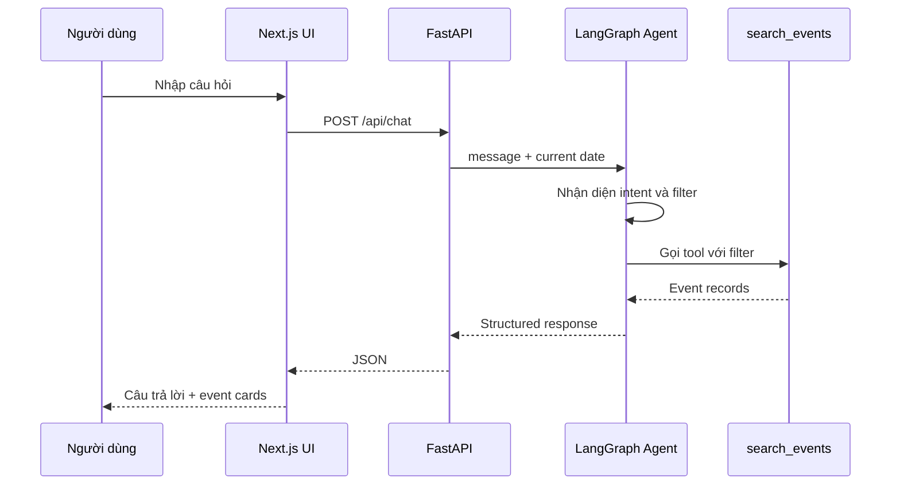

# Template AI Spec *(spec.md — commit trước 23:59 N1 · quality bar chốt từ thời điểm nộp)*

> Cấu trúc phủ đúng "SPEC 8 phần" của chương trình: Bằng chứng (§1-§2) · Lát cắt (§4) · Canvas (đính kèm CP1) · Augment/Automate (§4) · 4 đường đi của trải nghiệm (§6) · Kiểu lỗi (§5) · Kiểm thử (§7) · Phân công (§8). Hướng dẫn viết từng mục: `02-guide.md`.

```markdown
# AI SPEC — [Tên lát cắt] · Nhóm [XX] · Zone [X]
Hướng: [ ] A — VLearn  [ ] B — Trợ lý Học viên  [ ] C — Làn mở
Loại: [ ] Tối ưu tính năng có sẵn  [ ] Tính năng mới

## §1. User & Job
- Job executor + workflow (đính kèm worksheet JTBD / ảnh sơ đồ):

Toàn bộ chi tiết về bảng khảo sát, phân tích JTBD và dữ liệu người dùng được lưu trữ tại Google Sheets:
🔗 **[Xem chi tiết Worksheet JTBD & Khảo sát tại đây](https://docs.google.-com/spreadsheets/d/1-dNWqq-InLUeJNqWO8F5MHti5VMNaVLCZl_6uLoDpIk/edit?gid=1972524902#gid=1972524902)**

- Core JTBD (không tên sản phẩm/AI trong câu): **Theo dõi và ghi nhớ đúng hạn những sự kiện phù hợp với bản thân khi thông tin nằm rải rác trên nhiều kênh, để kịp đăng ký và tham dự các cơ hội mình quan tâm.**
- Problem statement (KHÔNG chữ AI): **Sinh viên muốn tham gia các sự kiện phù hợp nhưng phải tự theo dõi thông tin phân tán trên nhiều kênh và tự ghi nhớ thời gian, deadline; vì vậy họ thường biết muộn, quên đăng ký hoặc bỏ lỡ sự kiện mong muốn.**
- Evidence (chuẩn A và/hoặc B — log đầy đủ trong repo):
  - Số liệu mining / kết quả khảo sát (`n = 20`, dữ liệu gốc: `survey-impact.csv`): `15/20 (75%)` từng bỏ lỡ ít nhất một sự kiện; `11/20 (55%)` đồng ý/hoàn toàn đồng ý rằng họ thường xuyên bỏ sót thông báo; `16/20 (80%)` phải theo dõi quá nhiều kênh; `17/20 (85%)` từng quên hạn đăng ký; `17/20 (85%)` muốn cách theo dõi thuận tiện hơn. Về nhu cầu, `14/20 (70%)` muốn nhắc trước sự kiện, `10/20 (50%)` muốn nhắc deadline, `14/20 (70%)` muốn tóm tắt nội dung và `12/20 (60%)` muốn thêm vào Google Calendar.
  - ≥5 quote/ví dụ nguyên văn + nguồn:
    1. `"> 3 lần"`; `"Hoàn toàn đồng ý"` với việc từng quên hạn đăng ký; chọn `"Nhắc trước khi sự kiện diễn ra"` — nguồn: `survey-impact.csv`, R01, 30/07/2026 15:21:21.
    2. `"> 3 lần"`; `"Hoàn toàn đồng ý"` với việc phải theo dõi quá nhiều kênh và từng quên hạn đăng ký — nguồn: `survey-impact.csv`, R02, 30/07/2026 15:24:32.
    3. `"2-3 lần"`; `"Đồng ý"` với việc thường xuyên bỏ sót thông báo; góp ý mở `"Tóm tắt"` — nguồn: `survey-impact.csv`, R11, 30/07/2026 15:32:36.
    4. `"> 3 lần"`; `"Đồng ý"` với việc theo dõi nhiều kênh và quên deadline; góp ý mở `"Tính năng nhắc nhở"` — nguồn: `survey-impact.csv`, R13, 30/07/2026 15:35:53.
    5. `"2-3 lần"`; `"Hoàn toàn đồng ý"` với việc phải theo dõi nhiều kênh, từng quên hạn đăng ký và muốn cách thuận tiện hơn — nguồn: `survey-impact.csv`, R16, 30/07/2026 16:01:33.

## §2. Impact & quyết định chọn
- Bảng impact ≥3 ứng viên (bao nhiêu người · tần suất · tốn gì mỗi lần · khả thi):

  | Ứng viên | Bao nhiêu người | Tần suất | Tốn gì mỗi lần | Khả thi |
  |---|---:|---|---|---|
  | Nhắc sự kiện và hạn đăng ký | `15/20 (75%)` từng bỏ lỡ; `17/20 (85%)` từng quên deadline | Cận dưới `≥37` lượt bỏ lỡ trong mẫu | Mất cơ hội tham gia hoặc hết hạn đăng ký | Cao: trích thời gian/deadline và tạo lời nhắc |
  | Tổng hợp sự kiện đa kênh | `16/20 (80%)` phải theo dõi quá nhiều kênh | Lặp lại mỗi lần tìm/cập nhật sự kiện; khảo sát chưa đo số lần/tuần | Tốn công chuyển kênh, tăng nguy cơ bỏ sót | Thấp–trung bình: cần tích hợp nhiều nguồn và xử lý trùng |
  | Tóm tắt nội dung sự kiện | `14/20 (70%)` muốn tính năng này | Mỗi lần đọc thông báo; khảo sát chưa đo số thông báo/tuần | Tốn thời gian đọc; khảo sát chưa đo số phút | Cao: tóm tắt một bài đăng bằng mô hình ngôn ngữ |
  | Gợi ý/lọc theo sở thích | `9/20 (45%)` muốn gợi ý; `6/20 (30%)` muốn lọc | Mỗi lần chọn giữa nhiều sự kiện | Tăng tải lựa chọn; chưa đo hậu quả trực tiếp | Trung bình: cần hồ sơ sở thích và tiêu chí matching |

- Ứng viên ĐÃ LOẠI + vì sao: **Tổng hợp đa nguồn** bị loại vì phạm vi kỹ thuật rộng, phải xử lý quyền truy cập và dữ liệu trùng; **tóm tắt nội dung** bị loại vì dù `14/20 (70%)` có nhu cầu nhưng khảo sát chưa chứng minh tổn thất trực tiếp; **gợi ý/lọc theo sở thích** bị loại vì nhu cầu thấp hơn (`9/20` và `6/20`) và khó tạo ground truth đánh giá trong thời gian hackathon.
- Ứng viên CHỌN + vì sao (bằng số): **Nhắc sự kiện và hạn đăng ký đúng lúc** được chọn vì `15/20 (75%)` đã từng bỏ lỡ sự kiện, cận dưới là `≥37` lượt bỏ lỡ trong mẫu, `17/20 (85%)` từng quên hạn đăng ký, `14/20 (70%)` muốn nhắc trước sự kiện và `10/20 (50%)` muốn nhắc deadline. Đây cũng là lát cắt khả thi nhất: nhận một thông báo có sẵn → trích thời gian/deadline → đề xuất mốc nhắc → người dùng xác nhận.

## §3. Giải pháp tương tự đã nghiên cứu
- [Sản phẩm 1]: flow / đáng học / đáng né / mình khác gì
- [Sản phẩm 2]: ...

## §4. Thiết kế
- Lát cắt MỘT CÂU (1 user · 1 việc · 1 quyết định AI · 1 kết quả):
- Non-goals (≥3 thứ KHÔNG build):
- Mức prototype nhắm tới: [ ] Sketch [ ] Mock [ ] Working — phần nào mock, phần nào thật:
- Automation: [ ] augment [ ] conditional [ ] automate — lý do theo cost-of-error:
- §4b. Nguyên tắc đã áp dụng (≥4 — HAX/PAIR, xem guide):
  | Nguyên tắc | Áp cụ thể vào đâu trong prototype |
  |---|---|

## §5. Kiểu lỗi — 4 lớp chỗ khó + kịch bản (≥8) [bảng theo guide §2.5]

## §6. Bốn đường đi của trải nghiệm
- Happy path: · Low-confidence (②): · Failure/không căn cứ (①): · Correction (user sửa):
- Khi bị đòi ngoài phạm vi (③): · Case đặc thù domain (④):

## §7. Kiểm thử
- Chiều chất lượng + định nghĩa kiểm chứng được:
- Golden set (≥20 case theo cơ cấu trong guide §2.6, file trong eval/):
- Quality bar (chốt từ 23:59, giữ nguyên sau đó): "Đạt khi ≥ ___% qua bộ, và ___"
- Kết quả các lượt chạy (bảng % — cập nhật đến trước CP6):

## §8. Phân công & kế hoạch
- Phân công có tên: spec / evidence / prompt / code / demo
- Willing users (≥3 tên) + kế hoạch vòng validation CP5 (3 câu hỏi, ai log):
- Multi-prototype (nếu làm): trục khác biệt của ≥2 phương án + lý do chọn:

## §9. Changelog
| Thời điểm | Đổi gì | Vì sao (trỏ về feedback/case nào) |
```
