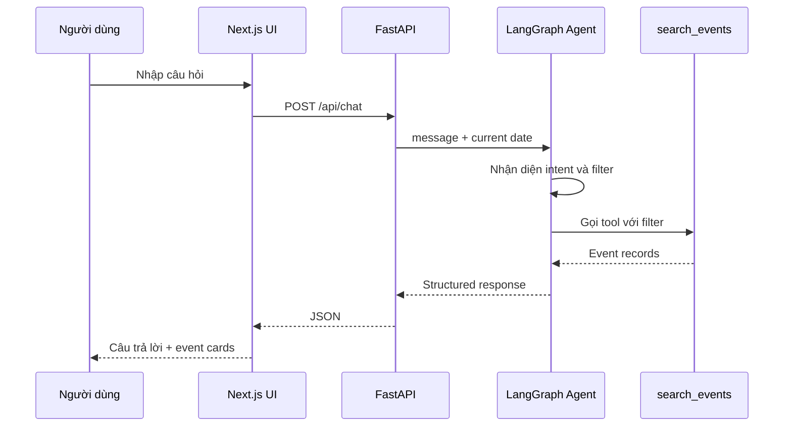

# Tính năng và flow hoạt động cho CP3

## 1. Tính năng trung tâm

### Trợ lý tìm sự kiện

Input có thể chứa:

- Thời gian: hôm nay, cuối tuần, tuần sau, tháng này.
- Chủ đề: công nghệ, kỹ năng, việc làm, cộng đồng.
- Chi phí: miễn phí hoặc có phí.
- Hình thức: online hoặc offline.
- Địa điểm hoặc đơn vị tổ chức.

Output:

- Câu trả lời ngắn.
- Tối đa 3 event card.
- Cảnh báo nếu dữ liệu mâu thuẫn.
- Gợi ý hành động tiếp theo.
- Confidence ở mức `high`, `medium` hoặc `low`.

## 2. Flow happy path

Ví dụ: “Cuối tuần này có workshop công nghệ miễn phí nào không?”

1. Frontend gửi câu hỏi.
2. Agent nhận diện `search_events`.
3. Agent tạo filter:
   - `date_from`, `date_to`: cuối tuần gần nhất.
   - `topic`: công nghệ.
   - `event_type`: workshop.
   - `cost`: free.
4. Agent gọi tool `search_events`.
5. Tool trả các event phù hợp.
6. Agent trả lời và không thêm dữ kiện ngoài tool result.
7. UI render câu trả lời cùng event card.



## 3. Flow thiếu thông tin

Ví dụ: “Có sự kiện nào hay không?”

Hành vi mong đợi:

1. Agent nhận diện intent tìm sự kiện.
2. Agent thấy không có thời gian và chủ đề.
3. Agent hỏi đúng một câu ngắn: “Bạn muốn tìm trong hôm nay, cuối tuần này hay tháng này?”
4. Không gọi tool với truy vấn quá rộng nếu chưa cần thiết.

Trong CP3 có thể coi thiếu thời gian là trường hợp cần hỏi lại; chủ đề có thể để rỗng.

## 4. Flow không có kết quả

Ví dụ: “Ngày mai có workshop blockchain miễn phí ở Đà Nẵng không?” nhưng dataset không có.

Agent phải:

- Nói rõ chưa tìm thấy trong dữ liệu hiện có.
- Không tạo tên hoặc địa điểm sự kiện.
- Gợi ý nới một điều kiện, ví dụ bỏ địa điểm hoặc mở rộng thời gian.

## 5. Flow thông tin mâu thuẫn

Event JSON có:

```json
{
  "status": "needs_confirmation",
  "conflicts": [
    {
      "field": "starts_at",
      "values": ["2026-08-07T14:00:00+07:00", "2026-08-07T15:00:00+07:00"]
    }
  ]
}
```

Agent phải:

- Hiển thị cả hai giờ.
- Nói rõ chưa xác nhận được giờ đúng.
- Không nói “sự kiện diễn ra lúc 15:00” như một sự thật.
- Có thể gợi ý người dùng xem thông tin chính thức.

## 6. Flow sửa lại câu hỏi

Người dùng: “Không phải tuần này, tuần sau.”

Agent cần dùng context tối thiểu của lượt trước:

- Giữ topic và các filter khác.
- Chỉ thay khoảng thời gian.
- Chạy lại tool.
- Trả kết quả mới.

CP3 lưu lịch sử hội thoại và filter gần nhất trong LangGraph state theo `conversation_id`.

## 7. Flow ngoài phạm vi

Người dùng: “Đăng ký workshop này giúp mình.”

Agent trả lời:

- Chưa thể đăng ký thay.
- Có thể cung cấp thông tin hoặc hướng dẫn đăng ký.
- Không gọi tool tạo reminder nếu người dùng chưa yêu cầu.

## 8. UI kết nối với CP3

### Trợ lý sự kiện

Chạy thật:

- Ô chat.
- Loading state.
- Error state.
- Câu trả lời.
- Event card từ API.

### Thông báo

Giữ mock trong CP3. Ghi chú trong README hoặc UI rằng dữ liệu minh họa.

### Lịch của tôi

Giữ mock trong CP3. Nút tạo lời nhắc có thể cập nhật state local.

## 9. Response contract để UI render

```json
{
  "conversation_id": "conv_demo_01",
  "answer": "Mình tìm thấy 1 sự kiện phù hợp.",
  "intent": "search_events",
  "confidence": "high",
  "clarifying_question": null,
  "events": [
    {
      "id": "evt_002",
      "title": "Tech Talk: Từ ý tưởng đến MVP",
      "starts_at": "2026-08-07T15:00:00+07:00",
      "location": "Lab 5.2",
      "status": "needs_confirmation",
      "warning": "Poster và caption ghi hai giờ khác nhau."
    }
  ],
  "suggested_actions": ["view_detail", "create_reminder"]
}
```

Frontend render action từ field có cấu trúc, không dò nút từ nội dung `answer`.
