# Workflow hệ thống CP3

## 1. Tổng quan hệ thống

Trong CP3, AI Agent và tool chạy thật nhưng nguồn sự kiện là mock dataset:

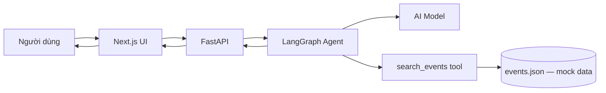

Phân biệt rõ:

- AI Model: chạy thật.
- LangGraph, System Prompt và Function Calling: chạy thật.
- `search_events`: chạy thật.
- `events.json`: dữ liệu giả tự sinh.
- Trang Thông báo và Lịch: vẫn có thể dùng mock UI trong CP3.

## 2. Workflow hỏi sự kiện

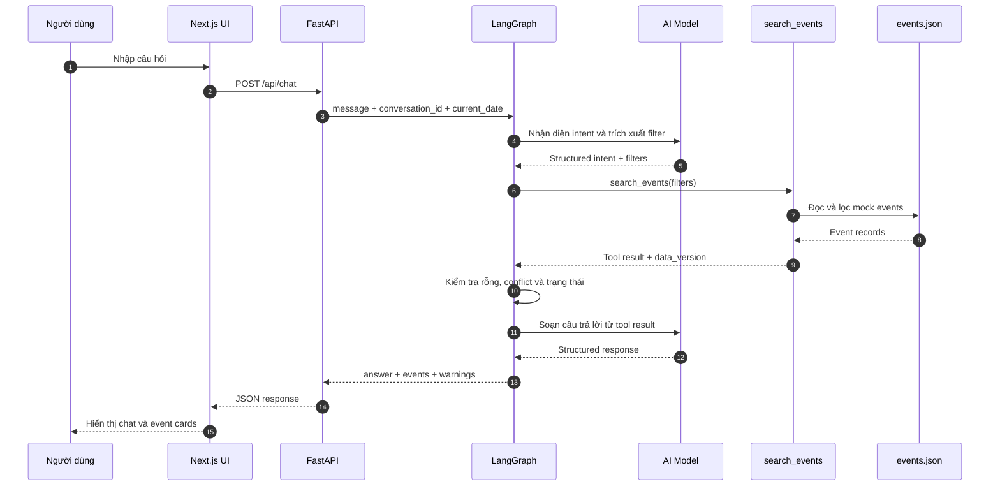

## 3. Workflow điều hướng của Agent

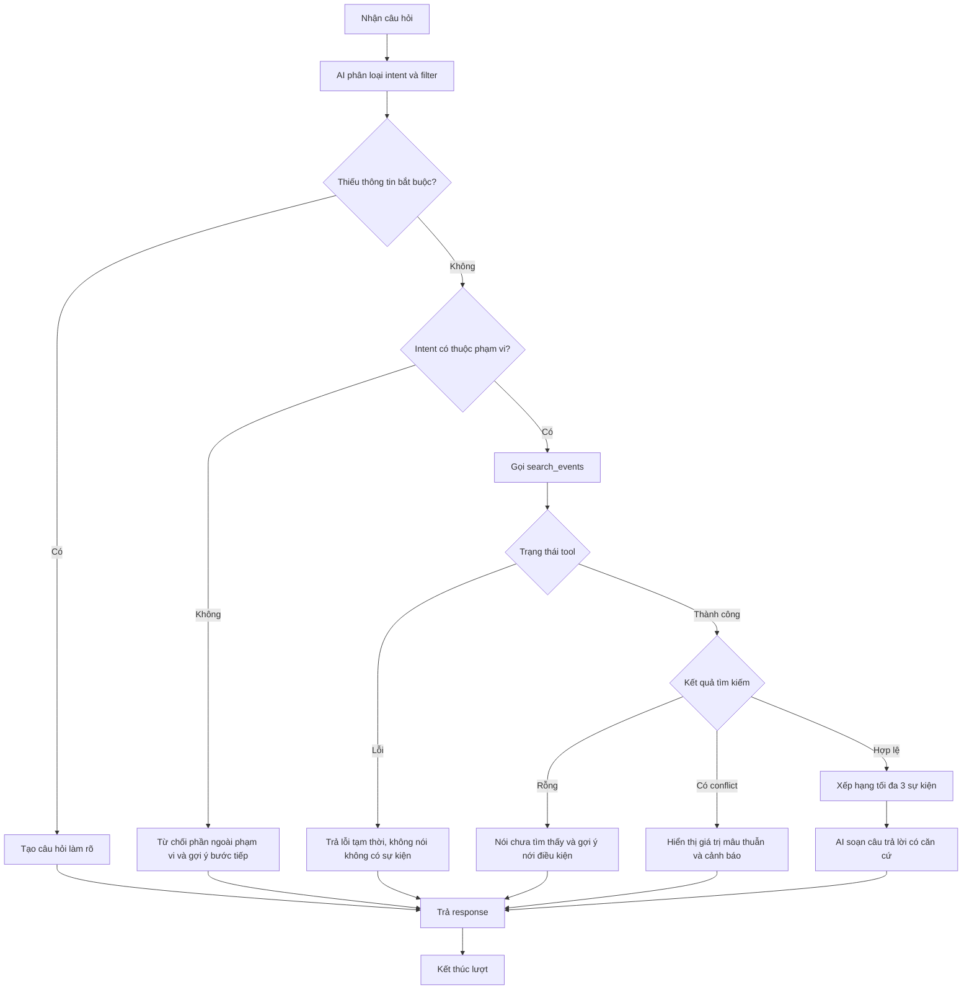

## 4. Workflow hỏi lại

Ví dụ: “Có sự kiện nào hay không?”

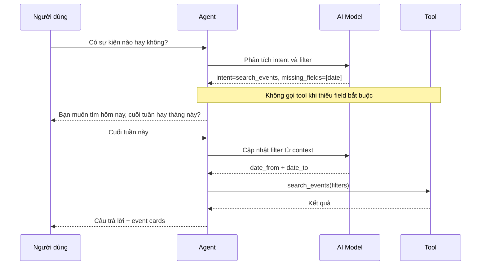

## 5. Workflow không có kết quả

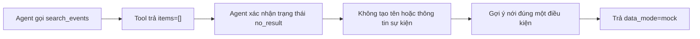

Ví dụ phản hồi:

> Trong dữ liệu minh họa, mình chưa tìm thấy workshop blockchain miễn phí ở Đà Nẵng vào ngày mai. Bạn có muốn mở rộng sang sự kiện online không?

## 6. Workflow dữ liệu mâu thuẫn

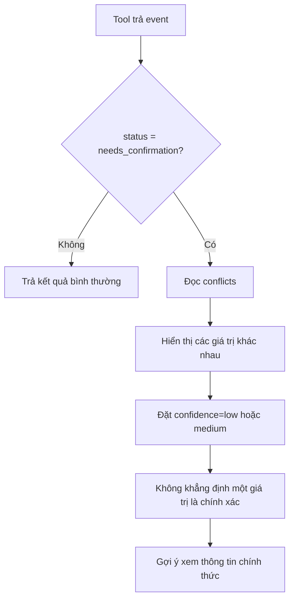

Trong CP3, nút tạo lời nhắc có thể vẫn là mock. Agent không được nói reminder đã được lưu ở backend nếu chức năng đó chưa được triển khai thật.

## 7. Workflow lỗi hệ thống

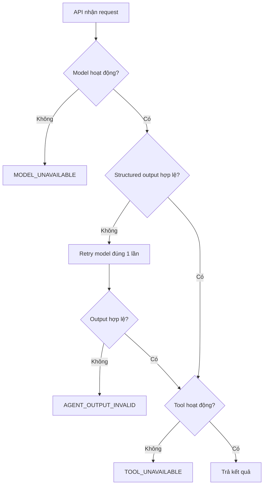

Quy tắc:

- Tool lỗi không đồng nghĩa với không có sự kiện.
- Không dùng câu trả lời hardcode để giả một lượt AI thành công.
- Mọi lỗi trả `trace_id` để kiểm tra.
- Frontend hiển thị nút thử lại.

## 8. Workflow evaluation

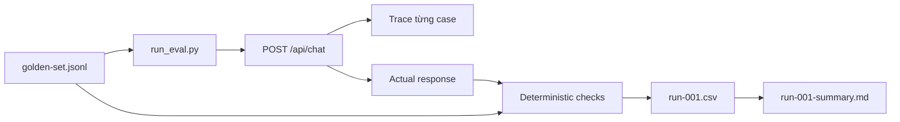

Mỗi case được kiểm tra:

1. Intent.
2. Filter.
3. Tool behavior.
4. Event IDs.
5. Groundedness.
6. Expected behavior.
7. Latency.

Không xóa case fail khỏi báo cáo.

## 9. Workflow trace và quan sát

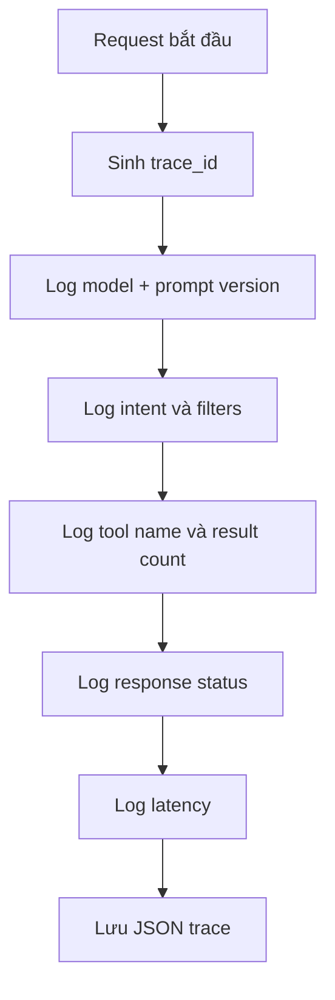

Không lưu API key, chain-of-thought, secret trong environment hoặc dữ liệu cá nhân không cần thiết.

## 10. Trạng thái một lượt chat

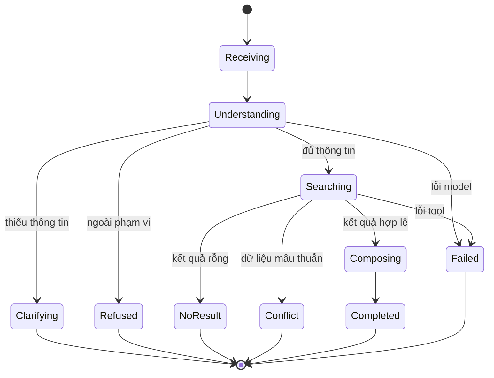

## 11. Workflow sau CP3

Chỉ triển khai sau khi vertical slice CP3 và golden set đã ổn:

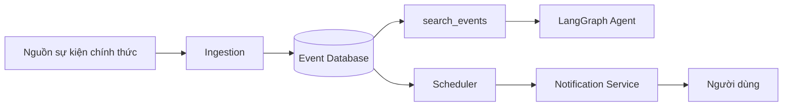

Khi có nguồn thật, chỉ thay repository của tool:

```text
MockJsonEventRepository
        ↓
OfficialApiEventRepository hoặc PostgresEventRepository
```

Tool contract, Agent graph, System Prompt contract và response schema nên được giữ nguyên.
