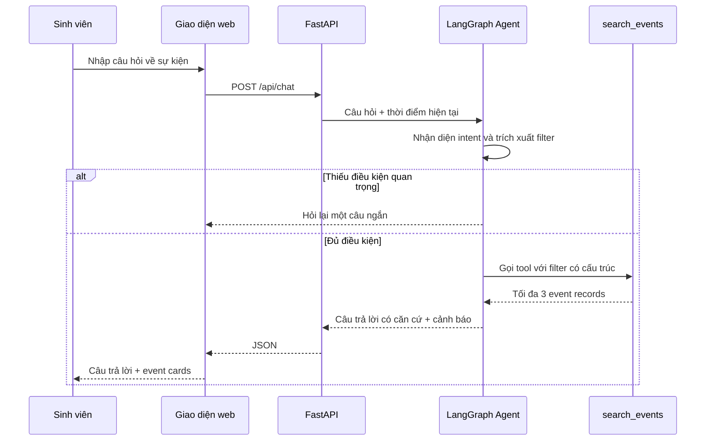

# AI SPEC — Trợ lý tìm sự kiện có căn cứ · Nhóm TooLongDidntRead · Zone 5

Hướng: [ ] A — VLearn · [x] B — Trợ lý Học viên · [ ] C — Làn mở
Loại: [ ] Tối ưu tính năng có sẵn · [x] Tính năng mới

> Trạng thái minh bạch: nội dung §1–§2 đã được commit trong file template trước hạn. Bản `spec.md` đầy đủ và quality bar được chính thức hóa sau hạn 23:59 N1. Quality bar bên dưới kế thừa ngưỡng đã ghi trong tài liệu thiết kế trước các lượt eval; nhóm không thay đổi ngưỡng theo kết quả run-005.

## §1. User & Job

### Job executor và workflow

Job executor là sinh viên muốn tìm một sự kiện phù hợp theo thời gian, chủ đề, chi phí, hình thức hoặc địa điểm.

- **Core JTBD:** Theo dõi và tìm đúng lúc những sự kiện phù hợp với bản thân khi thông tin nằm rải rác trên nhiều kênh, để kịp đăng ký và tham dự các cơ hội mình quan tâm.
- **Problem statement:** Sinh viên muốn tham gia các sự kiện phù hợp nhưng phải tự theo dõi thông tin phân tán trên nhiều kênh và tự ghi nhớ thời gian, deadline; vì vậy họ thường biết muộn, quên đăng ký hoặc bỏ lỡ sự kiện mong muốn.

### Evidence

Nguồn khảo sát: [Worksheet JTBD và khảo sát](https://docs.google.com/spreadsheets/d/1-dNWqq-InLUeJNqWO8F5MHti5VMNaVLCZl_6uLoDpIk/edit?gid=1972524902#gid=1972524902).

> Cần xác nhận trước khi nộp: link phải mở được cho người chấm và repo cần có evidence log được phép chia sẻ. File `survey-impact.csv` được nhắc trong bản nháp nhưng hiện chưa có trong repo.

- Mẫu `n = 20`.
- `15/20 (75%)` từng bỏ lỡ ít nhất một sự kiện.
- `11/20 (55%)` đồng ý hoặc hoàn toàn đồng ý rằng họ thường xuyên bỏ sót thông báo.
- `16/20 (80%)` phải theo dõi quá nhiều kênh.
- `17/20 (85%)` từng quên hạn đăng ký.
- `17/20 (85%)` muốn cách theo dõi thuận tiện hơn.
- `14/20 (70%)` muốn nhắc trước sự kiện.
- `10/20 (50%)` muốn nhắc deadline.
- `14/20 (70%)` muốn tóm tắt nội dung.
- `12/20 (60%)` muốn thêm vào Google Calendar.

Năm trích dẫn/quan sát đã ẩn danh:

1. `"> 3 lần"`; `"Hoàn toàn đồng ý"` với việc từng quên hạn đăng ký; chọn `"Nhắc trước khi sự kiện diễn ra"` — nguồn: khảo sát, R01, 30/07/2026 15:21:21.
2. `"> 3 lần"`; `"Hoàn toàn đồng ý"` với việc phải theo dõi quá nhiều kênh và từng quên hạn đăng ký — nguồn: khảo sát, R02, 30/07/2026 15:24:32.
3. `"2-3 lần"`; `"Đồng ý"` với việc thường xuyên bỏ sót thông báo; góp ý mở `"Tóm tắt"` — nguồn: khảo sát, R11, 30/07/2026 15:32:36.
4. `"> 3 lần"`; `"Đồng ý"` với việc theo dõi nhiều kênh và quên deadline; góp ý mở `"Tính năng nhắc nhở"` — nguồn: khảo sát, R13, 30/07/2026 15:35:53.
5. `"2-3 lần"`; `"Hoàn toàn đồng ý"` với việc phải theo dõi nhiều kênh, từng quên hạn đăng ký và muốn cách thuận tiện hơn — nguồn: khảo sát, R16, 30/07/2026 16:01:33.

## §2. Impact và quyết định chọn

| Ứng viên | Bao nhiêu người | Tần suất | Tổn thất mỗi lần | Khả thi trong hackathon |
|---|---:|---|---|---|
| Tìm sự kiện theo nhu cầu trong một hội thoại | `15/20 (75%)` từng bỏ lỡ; `16/20 (80%)` theo dõi quá nhiều kênh | Lặp lại mỗi lần tìm/cập nhật sự kiện; khảo sát chưa đo số lần/tuần | Tốn công chuyển kênh, tăng nguy cơ bỏ sót | Cao: AI chuyển ngôn ngữ tự nhiên thành filter; tool truy xuất dữ liệu có cấu trúc |
| Nhắc sự kiện và hạn đăng ký | `17/20 (85%)` từng quên deadline; `14/20 (70%)` muốn nhắc sự kiện | Cận dưới `≥37` lượt bỏ lỡ trong mẫu | Mất cơ hội tham gia hoặc hết hạn đăng ký | Trung bình: có thể đề xuất mốc nhắc; scheduler/notification thật nằm ngoài lát cắt |
| Tóm tắt nội dung sự kiện | `14/20 (70%)` muốn tính năng này | Mỗi lần đọc thông báo; chưa đo số thông báo/tuần | Tốn thời gian đọc; chưa đo số phút | Cao cho một bài đăng, nhưng chưa giải quyết khâu tìm đúng sự kiện |
| Gợi ý/lọc theo sở thích dài hạn | `9/20 (45%)` muốn gợi ý; `6/20 (30%)` muốn lọc | Mỗi lần chọn giữa nhiều sự kiện | Tăng tải lựa chọn; chưa đo hậu quả trực tiếp | Trung bình: cần hồ sơ sở thích và ground truth matching |

### Ứng viên bị loại hoặc hoãn

- **Crawler/tổng hợp đa nguồn thật:** hoãn vì phạm vi kỹ thuật rộng, liên quan quyền truy cập và xử lý trùng.
- **Notification/scheduler thật:** hoãn vì cần hạ tầng chạy nền và quyền gửi thông báo; prototype chỉ gợi ý `create_reminder`.
- **Tóm tắt nội dung:** loại khỏi lát cắt vì khảo sát chưa đo tổn thất trực tiếp và nó không giải quyết quyết định tìm sự kiện.
- **Personalization dài hạn:** loại vì nhu cầu thấp hơn và khó tạo ground truth trong thời gian hackathon.

### Ứng viên được chọn

**Sinh viên hỏi một câu về sự kiện; AI quyết định intent và bộ lọc, tool tìm trong nguồn có cấu trúc, hệ thống trả tối đa ba kết quả có căn cứ hoặc một đường lui an toàn.**

Lát cắt này giữ được nhu cầu đã chứng minh nhưng khớp với phần chạy thật: AI chịu trách nhiệm hiểu câu hỏi; dữ liệu sự kiện đến từ tool, không nằm trong trí nhớ mô hình. Nút tạo lời nhắc chỉ là hành động gợi ý/mock và không được mô tả như chức năng backend đã hoàn thành.

## §3. Giải pháp tương tự đã nghiên cứu

> Đây là desk comparison để định hướng flow, chưa thay cho log dùng thử có ảnh chụp. Nhóm cần bổ sung log nếu muốn dùng phần này làm bằng chứng nghiên cứu sản phẩm.

| Giải pháp | Flow liên quan | Đáng học | Đáng tránh | Khác biệt của lát cắt |
|---|---|---|---|---|
| Google Calendar | Người dùng đã biết sự kiện rồi mới nhập hoặc nhận invite để lưu/nhắc | Thời gian, địa điểm và reminder có cấu trúc; người dùng xác nhận trước khi lưu | Không giải quyết tốt việc tìm sự kiện khi thông tin còn rải rác | Prototype tập trung vào bước trước Calendar: hiểu nhu cầu và tìm event; chưa tự ghi lịch |
| Chatbot/LLM tổng quát | Người dùng hỏi bằng ngôn ngữ tự nhiên và nhận câu trả lời hội thoại | Input tự nhiên, sửa câu hỏi nhanh | Có thể bịa tên, giờ hoặc link nếu không bị buộc vào nguồn | Mọi event card phải đến từ `search_events`; factual response được dựng từ tool result |
| Tìm kiếm/filter truyền thống | Người dùng tự chọn ngày, loại, chi phí, địa điểm | Kết quả ổn định và dễ kiểm soát | Tốn thao tác; khó với cụm thời gian như “cuối tuần này” | AI chỉ chuyển câu hỏi thành filter; retrieval vẫn deterministic và trace được |

## §4. Thiết kế

### Lát cắt một câu

**Một sinh viên hỏi một câu để tìm sự kiện; AI quyết định intent và bộ lọc; tool truy xuất dữ liệu; người dùng nhận tối đa ba event có căn cứ, cảnh báo hoặc câu hỏi làm rõ.**

### Non-goals

1. Không crawl Facebook, Discord, VLearn hoặc nguồn thật chưa được cấp quyền.
2. Không đăng ký sự kiện thay người dùng.
3. Không tạo notification/scheduler hoặc đồng bộ Google Calendar thật.
4. Không truy cập lịch cá nhân của người khác.
5. Không xây auth, database production, vector database hoặc multi-agent.
6. Không dùng model để tự sáng tác dữ kiện sự kiện.

### Mức prototype và phần thật/mock

- **Mức nhắm tới:** Working vertical slice.
- **Chạy thật:** `POST /api/chat`; model qua OpenAI-compatible API; LangGraph chia workflow thành các node; System Prompt nhận diện intent/filter; Function Calling tạo structured call `search_events`; backend kiểm soát và thực thi tool; grounded response; trace; golden-set runner.
- **Mock:** `backend/data/events.json` là dữ liệu tự sinh; các URL dùng `.invalid`; trang Thông báo/Lịch; thao tác tạo lời nhắc; crawler và notification.
- **Ranh giới an toàn:** UI/demo phải ghi rõ dữ liệu minh họa, không ngụ ý đang đọc trực tiếp hệ thống VLearn.

### Mức automation

**Conditional automation.** Hệ thống tự trả lời khi intent/filter đủ rõ và kết quả có căn cứ; khi thiếu thời gian thì hỏi lại; khi ngoài phạm vi thì từ chối; khi dữ liệu mâu thuẫn thì cảnh báo.

Cost-of-error: trả sai giờ, deadline hoặc trạng thái có thể làm sinh viên bỏ lỡ sự kiện. Vì vậy AI được tự động hóa bước hiểu truy vấn có lỗi sửa được, nhưng không được tự tạo fact và không được tự đăng ký hoặc gửi reminder.

### §4b. Nguyên tắc HAX/PAIR đã áp dụng

| Nguyên tắc | Áp dụng cụ thể |
|---|---|
| HAX G1 — Làm rõ hệ thống làm được gì | Phạm vi API/README chỉ nêu tìm kiếm sự kiện; yêu cầu đăng ký hoặc xem lịch người khác đi sang `out_of_scope` |
| HAX G2 — Làm rõ hệ thống làm tốt đến đâu | Response trả confidence; event mock có `is_mock`; trạng thái `needs_confirmation` sinh warning; README tách phần thật/mock |
| HAX G10 — Thu hẹp phạm vi khi nghi ngờ | `missing_fields` chứa `date` thì graph đi sang `ask_clarification`, không gọi search với truy vấn quá rộng |
| HAX G9 — Sửa dễ dàng | Hội thoại cho phép người dùng hỏi lại/đổi điều kiện; filter được trả trong response/trace để debug và sửa |
| HAX G11 / PAIR Explainability + Trust | Câu trả lời factual dựng trực tiếp từ event record và kèm source URL/status; trace lưu exact events, filter, model và prompt version |
| PAIR Errors + Graceful Failure | Không có kết quả thì gợi ý đổi thời gian/chủ đề; lỗi API trả thông báo thử lại; conflict và out-of-scope có đường lui riêng |
| PAIR Feedback + Control | `suggested_actions` chỉ là gợi ý; hệ thống không tự đăng ký hay tạo lời nhắc, người dùng giữ quyền quyết định |

## §5. Kiểu lỗi — bốn lớp chỗ khó và kịch bản

| ID | Tình huống cụ thể | Lớp | Hành vi mong muốn | Nguyên tắc | Golden case |
|---|---|---|---|---|---|
| R1 | Không có event khớp nhưng model có thể bịa tên workshop | ① Nguồn sự thật | Nói chưa tìm thấy, trả zero event, gợi ý nới filter | G11, Graceful Failure | GS-011, GS-023, GS-024 |
| R2 | Event có hai giờ mâu thuẫn | ① Nguồn sự thật | Hiện warning, không khẳng định một giờ là chắc chắn, gợi ý kiểm tra nguồn | G2, G11 | GS-012 |
| R3 | “Có sự kiện nào hay không?” thiếu thời gian | ② Mơ hồ/thiếu thông tin | Hỏi một câu về khoảng thời gian; chưa gọi tool | G10 | GS-009 |
| R4 | “Gần đây” không có mốc rõ | ② Mơ hồ/thiếu thông tin | Không tự quy ước; hỏi lại thời gian | G10 | GS-010 |
| R5 | “Đăng ký workshop giúp mình” | ③ Ngoài phạm vi/thẩm quyền | Nói chưa hỗ trợ đăng ký; không tuyên bố thành công | G1, G17 | GS-013 |
| R6 | Yêu cầu xem lịch cá nhân của người khác | ③ Ngoài phạm vi/thẩm quyền | Từ chối, không tiết lộ hoặc suy đoán lịch | G1, G17 | GS-014 |
| R7 | Event đã hết deadline nhưng vẫn còn trong dữ liệu | ④ Đặc thù domain | Hiện deadline/status từ nguồn; không nói “còn hạn” | G2, G11 | GS-015, GS-021 |
| R8 | Event đã bị hủy | ④ Đặc thù domain | Chỉ trả khi người dùng hỏi đích danh; hiển thị trạng thái hủy/cảnh báo | G2, Graceful Failure | GS-016 |
| R9 | “Online” bị hiểu thành địa điểm thay vì format | ④ Đặc thù domain | Chuẩn hóa `format=online`; không đặt `location=online` | G9 | GS-003, GS-023 |
| R10 | Cụm “hôm nay/cuối tuần/tuần sau” lệch biên ngày hoặc timezone | ④ Đặc thù domain | Chuẩn hóa Asia/Ho_Chi_Minh, đầu/ngày cuối ngày nhất quán | G2 | GS-001, GS-002, GS-020 |

Rủi ro đáng sợ nhất khi demo là **trả một giờ/deadline sai như sự thật**, vì output trông hợp lý nhưng có thể làm người dùng bỏ lỡ sự kiện. Biện pháp chính là retrieval có cấu trúc, deterministic composition, warning cho conflict và groundedness hard bar 100%.

## §6. Bốn đường đi của trải nghiệm

### Happy path

1. User: “Cuối tuần này có sự kiện công nghệ miễn phí nào không?”
2. AI trả intent `search_events` và filter thời gian/chủ đề/chi phí.
3. Tool trả event thật trong dataset.
4. UI hiện câu trả lời ngắn và event card.
5. User có thể xem chi tiết hoặc chọn hành động tạo reminder đang ở mức mock.

### Low-confidence / thiếu thông tin

1. User: “Có sự kiện nào hay không?”
2. Hệ thống phát hiện thiếu thời gian.
3. Hệ thống hỏi: “Bạn muốn tìm sự kiện trong hôm nay, cuối tuần này hay khoảng thời gian nào?”
4. Không gọi tool cho tới khi đủ điều kiện.

### Failure / không có căn cứ

- Không có kết quả: nói rõ chưa tìm thấy trong dữ liệu hiện có và gợi ý nới filter.
- Tool/API lỗi: trả thông báo hệ thống đang bận và gợi ý thử lại.
- Dữ liệu mâu thuẫn: hiện cảnh báo và các giá trị nguồn; không chọn hộ một giá trị.
- Không được tạo event, deadline, địa điểm hoặc URL ngoài tool result.

### Correction

User có thể đặt lại một câu đầy đủ để sửa điều kiện. Response và trace cho thấy filter đã dùng, giúp nhóm kiểm tra việc sửa. **Partial correction nhiều lượt** như “Không phải tuần này, tuần sau” hiện chưa được nối với state của lượt trước trong API, vì vậy chưa được tuyên bố là phần chạy thật; hoặc phải hoàn thiện và thêm golden case, hoặc demo yêu cầu người dùng nhắc lại đầy đủ điều kiện.

### Ngoài phạm vi

Yêu cầu đăng ký, xem lịch người khác hoặc thao tác tài khoản được chuyển sang `out_of_scope`. Hệ thống nói rõ chỉ hỗ trợ tìm kiếm, không thực hiện hành động và không tuyên bố đã làm xong.

### Case đặc thù domain

Event hết hạn, đã hủy hoặc có thông tin chưa xác nhận phải hiện trạng thái tương ứng. Dữ liệu mock phải luôn được gắn nhãn minh họa; URL `.invalid` không được trình bày như đường đăng ký thật.

## §7. Kiểm thử

### Chiều chất lượng và định nghĩa pass/fail

| Chiều | Pass khi | Fail khi |
|---|---|---|
| Intent | Intent đúng với expected intent | Tìm kiếm bị từ chối hoặc yêu cầu ngoài phạm vi bị coi là tìm kiếm |
| Filter | Tất cả filter bắt buộc có và khớp giá trị/timezone | Thiếu/sai bất kỳ filter bắt buộc |
| Tool | Gọi hoặc không gọi tool đúng theo expected behavior | Gọi tool khi phải hỏi lại/từ chối, hoặc không gọi khi phải search |
| Retrieval | Tập event ID trả về bằng expected IDs | Có false positive hoặc thiếu event kỳ vọng |
| Groundedness | Event fields bằng source record, answer deterministic và không chứa forbidden claim | Có fact ngoài source, sai field hoặc claim bị cấm |
| Behavior | Nhánh response đúng: result, clarification, no-result, conflict, refusal | Đi sai nhánh trải nghiệm |
| Overall | Đồng thời pass tất cả chiều trên | Fail ít nhất một chiều |

### Golden set

- File: `backend/eval/golden-set.jsonl`.
- Quy mô: 24 case.
- Cơ cấu hiện có: 14 happy path, 2 clarification, 3 no-result, 1 conflict, 2 out-of-scope và 2 domain edge.
- Mỗi run lưu CSV, summary, snapshot golden set, snapshot event data và trace.
- Hạn chế cần công khai: golden set hiện do nhóm tự xây trên dữ liệu sự kiện mock; chưa có bằng chứng `≥10` case phát triển từ chatlog thật. Trước CP5, hoặc bổ sung nguồn case hợp lệ và rerun thành run mới, hoặc trình bày rõ lý do dùng dữ liệu tự sinh theo ràng buộc bảo mật.

### Quality bar

Quality bar áp dụng:

> **Ship khi Overall ≥ 80%, Intent ≥ 90%, Groundedness = 100%, mọi case no-result không bịa event và mọi case ngoài phạm vi không thực hiện hành động.**

Nguồn quyết định: ngưỡng này đã được ghi ở `docs/04-data-and-golden-set.md` trong tài liệu thiết kế commit trước các run-003/004/005. Việc đưa chính thức vào `spec.md` diễn ra muộn; nhóm không nâng/hạ bar theo kết quả cuối.

### Kết quả các lượt chạy

| Run | Cases | Overall | Intent | Filter | Tool | Retrieval | Groundedness | Behavior | Kết luận |
|---|---:|---:|---:|---:|---:|---:|---:|---:|---|
| run-001 | 8 | 50.0% | 100.0% | — | — | 50.0% | — | — | Không đạt; bộ đo ban đầu chưa đầy đủ |
| run-002 | 24 | 54.2% | 95.8% | 62.5% | 91.7% | 87.5% | 87.5% | 87.5% | Không đạt; lỗi chính ở filter và groundedness |
| run-003 | 24 | 79.2% | 100.0% | 79.2% | 100.0% | 100.0% | 100.0% | 100.0% | Chưa đạt Overall, thiếu 0.8 điểm % |
| run-004 | 24 | 87.5% | 95.8% | 91.7% | 100.0% | 95.8% | 100.0% | 100.0% | Đạt bar |
| run-005 | 24 | 91.7% | 100.0% | 91.7% | 100.0% | 100.0% | 100.0% | 100.0% | Đạt bar; fail GS-004 và GS-006 ở filter |

Hai case fail cuối được giữ nguyên. Snapshot/hash trong run-004 và run-005 giúp ngăn việc âm thầm sửa golden set hoặc event data sau khi chạy.

## §8. Phân công và kế hoạch

### Phân công hiện có theo bằng chứng Git

| Người/handle | Phần đã có bằng chứng | Việc tiếp theo |
|---|---|---|
| `nguyenquanghuongt67-ai` | §1–§2, evidence/impact trong bản spec ban đầu | Xác nhận evidence link, nguồn khảo sát và nghiên cứu sản phẩm |
| `Huy0123` | Backend Agent, tool/filter normalization, eval và trace | Chạy regression/dry run, giải thích case fail và phần thật/mock |
| `Monmon39` | Commit CP2 và các image/prototype artifact | Xác nhận flow UI, chuẩn bị demo happy/failure path |

> Cần thay handle bằng tên + mã học viên chính thức trong README/spec và xác nhận lại phân công với cả nhóm.

### Willing users và validation CP5

- Người dùng dự kiến: **W1 — chưa điền tên**, **W2 — chưa điền tên**, **W3 — chưa điền tên**.
- Người phụ trách log: **chưa xác nhận**.
- Mỗi session phải ghi: tên/mã ẩn danh, thời điểm, input, output quan sát được, quote nguyên văn ngắn, vấn đề, quyết định thay đổi/không đổi.

Ba câu hỏi validation:

1. “Bạn nghĩ trợ lý này làm được gì và không làm được gì?”
2. “Với kết quả vừa nhận, bạn có biết nên tin/kiểm tra phần nào và bước tiếp theo là gì không?”
3. “Hãy thử một câu khó hoặc sửa lại truy vấn; chỗ nào khiến bạn do dự hoặc không hiểu?”

Kế hoạch CP5:

1. Điền thành viên và willing users.
2. Test với ít nhất 3 người, thu tối thiểu 5 feedback có tên/mã.
3. Chạy một happy path, một clarification, một no-result/conflict và một out-of-scope.
4. Ghi changelog trỏ từ mỗi thay đổi về feedback hoặc eval case.
5. Chạy lại test/eval nếu code/prompt thay đổi; tạo run mới, không ghi đè run-005.
6. Dry run demo 5 phút và chuẩn bị case lỗi live.

### Multi-prototype

Không triển khai multi-prototype trong lát cắt hiện tại. Nhóm ưu tiên một vertical slice chạy thật và đo được thay vì hai phương án nửa hoàn chỉnh.

## §9. Changelog

| Thời điểm | Đổi gì | Vì sao / bằng chứng |
|---|---|---|
| 30/07/2026 17:15 | Điền evidence, JTBD, impact và ứng viên chọn/loại trong file template | Kết quả khảo sát `n=20`; commit `05a1bfe` |
| 30/07/2026 17:25–17:31 | Bổ sung hướng, workflow và link worksheet | Các commit `52e0a4e` đến `7b6d26b` |
| 31/07/2026 00:01 | run-003 đạt 19/24, giữ nguyên 5 filter fail | `run-003-summary.md` |
| 31/07/2026 00:04 | run-004 đạt 21/24; lưu hash, snapshot và traces | `run-004-summary.md` |
| 31/07/2026 00:15 | run-005 đạt 22/24; giữ GS-004 và GS-006 fail | `run-005-summary.md` |
| 31/07/2026 sau hạn 23:59 | Đổi deliverable thành `spec.md`; đồng bộ lát cắt với CP3; hoàn thiện §3–§9 và chính thức hóa quality bar | Sửa khoảng lệch giữa bản spec “nhắc deadline” và implementation “tìm event”; minh bạch việc hoàn thiện muộn |

## Việc còn thiếu trước CP5

- [ ] Xác nhận tên + mã học viên và phân công chính thức.
- [ ] Điền tên ≥3 willing users và người phụ trách feedback log.
- [ ] Xác nhận Google Sheets mở được; bổ sung evidence log hợp lệ vào repo.
- [ ] Bổ sung log/ảnh nghiên cứu ≥2 giải pháp tương tự.
- [ ] Quyết định cách xử lý yêu cầu ≥10 golden case phát triển từ chatlog thật mà không vi phạm bảo mật.
- [ ] Xác minh correction nhiều lượt trong UI/backend; hiện eval chủ yếu single-turn.
- [ ] Cập nhật README nhóm, tạo `validation/`, slide final và reflection cá nhân.
